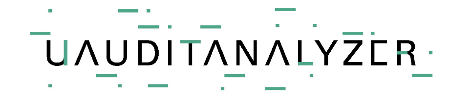

# uAuditAnalyzer2 - Unmanarc's Auditd Analyzer

Author: Aarón Mizrachi <aaron@unmanarc.com>  
License: GPLv3  

uAuditAnalyzer2 is intended to be a high-efficient application to centrally receive, interpret, analyze and detect potential threats trough auditd logs via rsyslog.

## Applications

### uanlz_log2json

This application is in charge of receiving the auditd logs through a centralized RSYSLOG connection. After that, log2json reassembles the disaggregated auditd messages into a single JSON message that can be sent via TCP to some downstream system (eg ELK, uAuditanalyzer Alerts, etc)

### uanlz_alert

uanlz_alert receives a TCP stream with 1 JSON per line in order to filter and execute actions (usually alerting).

uanlz_alert uses a filter system based on a JSONPath mechanism integrated with an expression evaluation mechanism provided by the cxFramework2 library, which allows comparison with advanced regular expressions, among other things.

### uanlz_web

uanlz_web is an integration system designed to manage and monitor the health of uAuditAnalyzer services. It is designed in HTML5 + JQUERY + BOOTSTRAP, using a webservices backend made in C ++ provided by the cxFramework2 library.

## Build Requirements 

This should be built on top of:

- cxFramework2 libraries - https://github.com/unmanarc/cxFramework2
- POCO Libraries
- JSONCPP (AT LEAST v1.7.7, for RHEL7 you will have to build it by hand or install an external RPM)
- C++11

## Minimum System Requirements

- CPU: 1 to N processors (optimized to be multithreaded)
- MEM: Min: 256M (depending on your configuration you may want more)
- Storage: Min: 16Gb including the whole container/OS), you may want to add more storage to keep some logs for long periods of time.

So... would it run in my Raspberry PI 4? 

YES. But in our experience, RPI4 only delivers enough power to analyzer some thousands of simultaneous servers with an average usage.

## Commercial Support
   
          

Tekium is a cybersecurity startup specialized in red team and blue team activities based in Mexico, it has several important clients in the financial sector around the world.

Tekium is currently sponsoring this project, and is also in charge of maintaining the project support at a commercial level.

If you need commercial support, integrations with other platforms such as ELK, managed SOC, and / or change requests for new functionalities that you want to be included in the next GPL version, do not hesitate to contact us: [info at tekium.mx](mailto:info@tekium.mx)